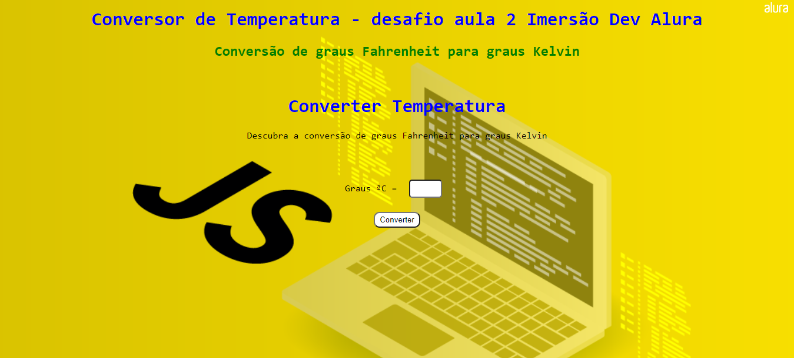

Conversor de temperatura desenvolvido durante o segundo dia da Imersão Dev da Alura em que converte a temperatura de graus Fahrenheit para graus Kelvin

Tecnologias usadas: HTML5, CSS3 e JavaScript

